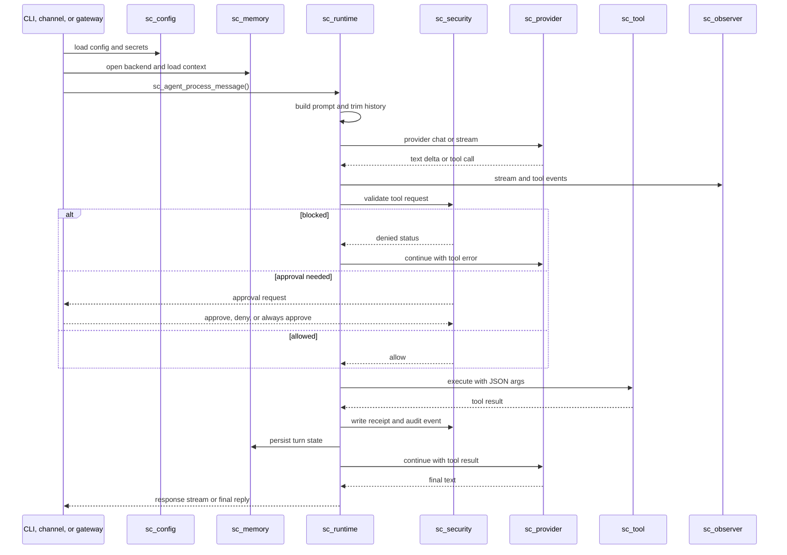

# Modular Architecture Map

This page maps SmolClaw's C23 modular architecture. It defines stable headers,
opaque handles, explicit ownership rules, and replaceable implementation
modules.

The architecture centers on a small agent kernel, explicit extension contracts,
pluggable providers/channels/tools/memory backends, security gates before side
effects, and a control plane for CLI, gateway, desktop, and hardware
integrations.

## Design goals

| Goal | C23 design response |
|---|---|
| Keep the microkernel shape | Put public contracts in `include/sc/*.h`; keep implementations in separately built modules. |
| Define C contracts safely | Use opaque structs plus const vtables of function pointers. |
| Avoid global ownership ambiguity | Every API documents caller-owned, borrowed, transferred, and allocator-owned values. |
| Make side effects auditable | Route all tool, shell, network, filesystem, hardware, and SaaS operations through security and receipt layers. |
| Keep builds small | Use CMake options to include only selected providers, channels, tools, hardware backends, and gateway features. |
| Support dynamic extension | Keep a stable C ABI for plugins, plus optional WASM plugin host support. |
| Compensate for missing C23 safety | Centralize allocation, string buffers, JSON validation, bounds checks, cleanup helpers, fuzz tests, sanitizers, and static analysis. |

## One-screen map

```mermaid
flowchart TB
    subgraph Users["Users and external systems"]
        CLI["Terminal CLI"]
        Chat["Chat, mail, voice, webhook, ACP platforms"]
        HTTP["Gateway clients<br/>REST, WebSocket, SSE, web dashboard"]
        HW["Boards and devices<br/>RPi, Pico, ESP32, Nucleo, Aardvark"]
        LLM["LLM and embedding providers"]
        FS["Filesystem, shell, network, SaaS APIs"]
    end

    subgraph App["C23 application shell"]
        Main["src/app/main.c<br/>argument parsing and process lifecycle"]
        Cli["src/app/cli/<br/>command handlers"]
        Service["src/app/app_service.c<br/>daemon and service integration"]
    end

    subgraph Contracts["Stable C contracts"]
        Api["include/sc/api.h<br/>base types, errors, allocators"]
        ProviderApi["include/sc/provider.h<br/>sc_provider_vtab"]
        ChannelApi["include/sc/channel.h<br/>sc_channel_vtab"]
        ToolApi["include/sc/tool.h<br/>sc_tool_vtab"]
        MemoryApi["include/sc/memory.h<br/>sc_memory_vtab"]
        RuntimeApi["include/sc/runtime.h<br/>sc_runtime_vtab, sc_agent"]
        PeripheralApi["include/sc/peripheral.h<br/>sc_peripheral_vtab"]
    end

    subgraph Core["Agent kernel"]
        Runtime["src/runtime/<br/>agent loop, prompt, history, tool orchestration"]
        Security["src/security/<br/>policy, sandbox, approval, audit, receipts"]
        Config["src/config/<br/>schema, secrets, workspace, migration"]
        Observability["src/observability/<br/>events, metrics, traces"]
    end

    subgraph Modules["Implementation modules"]
        Providers["src/providers/<br/>HTTP providers, compatible APIs, local adapters"]
        Channels["src/channels/<br/>Telegram, webhooks, ACP, mail, RabbitMQ"]
        Tools["src/tools/<br/>shell, file, browser, HTTP, memory, MCP"]
        Memory["src/memory/<br/>SQLite, markdown, no-op, hydration"]
        Gateway["src/gateway/<br/>HTTP-style control plane"]
        Hardware["src/hardware/<br/>USB, serial, GPIO, board tooling"]
        Plugins["src/plugins/<br/>C ABI and WASM plugin host"]
    end

    subgraph Support["Shared support"]
        Corelib["src/core/<br/>strings, buffers, vectors, maps, time, status"]
        Json["src/json/<br/>DOM and schema helpers"]
        Net["src/net/<br/>HTTP, URL, libuv async"]
        Media["src/media/<br/>attachments, ASR, TTS"]
        Registry["src/registry, src/contracts<br/>registries and handle contracts"]
        I18n["src/i18n/<br/>message catalog wrapper"]
    end

    CLI --> Main
    Main --> Cli
    Main --> Service
    Cli --> Runtime
    Chat --> Channels
    HTTP --> Gateway
    HW --> Hardware

    Runtime --> Providers
    Runtime --> Tools
    Runtime --> Memory
    Runtime --> Security
    Runtime --> Observability
    Runtime --> Config
    Gateway --> Runtime
    Gateway --> Security
    Channels --> Runtime
    Plugins --> Tools
    Plugins --> Channels
    Providers --> LLM
    Tools --> FS
    Hardware --> HW

    Providers --> ProviderApi
    Channels --> ChannelApi
    Tools --> ToolApi
    Memory --> MemoryApi
    Runtime --> RuntimeApi
    Hardware --> PeripheralApi
    ProviderApi --> Api
    ChannelApi --> Api
    ToolApi --> Api
    MemoryApi --> Api
    RuntimeApi --> Api
    PeripheralApi --> Api

    Core --> Corelib
    Modules --> Corelib
    Modules --> Json
    Modules --> Net
    Core --> Media
    Core --> Registry
    Core --> I18n
```



## Current Repository Layout

The repository builds one executable plus `sc_core`, with optional dependency
targets selected in CMake. Keep public headers small and stable. Private
headers are owned by their matching subsystem; many current private headers live
under `include/<subsystem>/`.

```text
./
  CMakeLists.txt
  CMakePresets.json
  Makefile
  cmake/
    options.cmake
    sanitizers.cmake
    warnings.cmake
    hardening.cmake
    deps.cmake
  include/
    sc/
      api.h
      result.h
      allocator.h
      buffer.h
      json.h
      provider.h
      channel.h
      tool.h
      memory.h
      observer.h
      registry.h
      runtime.h
      security.h
      sandbox.h
      peripheral.h
      plugin.h
      version.h
    app/
    config/
    core/
    json/
    media/
    memory/
    net/
    runtime/
    security/
    tools/
  src/
    app/
      main.c
      cli/
      app_service.c
      app_runtime_commands.c
      app_onboard.c
    autonomy/
    contracts/
    registry/
    core/
      allocator.c
      buffer.c
      string.c
      vector.c
      map.c
      time.c
      result.c
    config/
      config.c
      config_source.c
      config_secret_store.c
      sc_config_schema.c
    runtime/
      agent.c
      bootstrap.c
      loop.c
      turn_queue.c
      channel_policy.c
    security/
      policy.c
      approval.c
      sandbox.c
      sandbox_container.c
      sandbox_landlock.c
      sandbox_bubblewrap.c
      sandbox_firejail.c
      estop.c
      audit.c
      receipts.c
      store.c
      domain_matcher.c
      workspace_boundary.c
    providers/
      http_providers.c
      compatible.c
      router.c
      reliable.c
      provider_common.c
      claude_code.c
      gemini_cli.c
      unsupported.c
      mock_provider.c
    channels/
      orchestrator.c
      telegram.c
      webhooks.c
      acp.c
    tools/
      shell.c
      file_read.c
      file_tools.c
      search_tools.c
      http_tool.c
      browser_tool.c
      memory_tools.c
      autonomy_tools.c
      diagnostic_tools.c
      mcp.c
      process_runner.c
      tool_common.c
      tool_wrappers.c
    memory/
      sqlite_memory.c
      markdown_memory.c
      none_memory.c
      memory_common.c
      memory_hydrate.c
    gateway/
      gateway.c
    hardware/
      hardware.c
    plugins/
      plugin.c
      plugin_python.c
    observability/
      observer_impls.c
      log.c
    i18n/
      i18n.c
    json/
      json.c
      json_schema.c
    net/
      async.c
      http_client.c
      url.c
  tests/
    unit/
    support/
    fixtures/
  docs/
  schema/
  vendor/
```

`src/` contains built-in modules. External plugins and examples compile against
`include/sc/*.h`; they must not include dependency headers or first-party
private headers.

## Public contract pattern

C does not have contracts. Use opaque handles plus vtables. The vtable is stable;
the implementation struct remains private to the module.

```c
/* include/sc/provider.h excerpt */
typedef struct sc_provider sc_provider;

typedef struct sc_provider_request {
    size_t struct_size;
    sc_str model;
    sc_str prompt;
    sc_str system_instruction;
    sc_str tool_specs_json;
    bool cancel_requested;
    sc_str route_hint;
} sc_provider_request;

typedef struct sc_provider_vtab {
    size_t struct_size;
    uint32_t abi_major;
    const char *name;
    const char *feature_flag;
    uint64_t capabilities;
    sc_status (*generate)(void *impl,
                          const sc_provider_request *request,
                          sc_allocator *alloc,
                          sc_provider_response *out);
    sc_status (*stream)(void *impl,
                        const sc_provider_request *request,
                        sc_allocator *alloc,
                        sc_provider_stream_callback callback,
                        void *callback_user_data);
    void (*destroy)(void *impl);
} sc_provider_vtab;
```

Every contract follows the same shape:

| Contract | Handle | Vtable |
|---|---|---|
| Provider | `sc_provider` | `sc_provider_vtab` |
| Channel | `sc_channel` | `sc_channel_vtab` |
| Tool | `sc_tool` | `sc_tool_vtab` |
| Memory | `sc_memory` | `sc_memory_vtab` |
| Observer | `sc_observer` | `sc_observer_vtab` |
| Runtime | `sc_runtime` / `sc_agent` | `sc_runtime_vtab` plus agent APIs |
| Peripheral | `sc_peripheral` | `sc_peripheral_vtab` |
| Sandbox | `sc_sandbox` | `sc_sandbox_vtab` |

Rules:

- Public structs must be append-only or versioned.
- Public functions return `sc_status`, never raw negative integers.
- Output values are written through explicit `out` parameters.
- Callers release returned owning values with matching `sc_*_clear`,
  `sc_*_destroy`, or documented release functions.
- No module exposes its concrete struct layout outside its private header.

## Ownership and memory model

C23 requires explicit ownership discipline. Make ownership part of the API.

| Type pattern | Meaning |
|---|---|
| `sc_str` | Borrowed immutable string view: pointer plus length, not necessarily null-terminated. |
| `sc_string` | Owned heap string allocated by `sc_allocator`. |
| `sc_buf` | Borrowed byte span. |
| `sc_bytes` | Owned byte buffer. |
| `sc_vec_*` | Owned typed dynamic array. |
| `const sc_* *` | Borrowed read-only object. |
| `sc_* *out` | Caller provides storage; callee initializes on success. |
| `sc_* **out` | Callee allocates and transfers ownership to caller. |

Core allocation policy:

- All modules receive a `sc_allocator *` directly or through an options/context
  struct owned by the caller.
- No production module calls `malloc`, `calloc`, `realloc`, or `free` directly.
- Long-lived runtime state uses explicit owner structs and destroy functions.
- Per-turn temporary state uses arenas reset at the end of the request.
- Sensitive buffers use secure zeroing before release.
- Cleanup uses one exit path and small local cleanup helpers.

Example result type:

```c
typedef enum sc_status_code {
    SC_OK = 0,
    SC_ERR_INVALID_ARGUMENT,
    SC_ERR_NO_MEMORY,
    SC_ERR_IO,
    SC_ERR_PARSE,
    SC_ERR_HTTP,
    SC_ERR_SECURITY_DENIED,
    SC_ERR_UNSUPPORTED,
    SC_ERR_TIMEOUT,
    SC_ERR_CANCELLED
} sc_status_code;

typedef struct sc_status {
    sc_status_code code;
    const char *error_key;
    char *message;
    sc_allocator *alloc;
} sc_status;
```

## Build Topology

Use one build graph. The current CMake tree builds `sc_core` plus the
`smolclaw` executable; feature flags are captured in generated
`include/sc/version.h` for reporting and runtime decisions. Dynamic plugins are
optional.

```text
smolclaw            executable
  sc_core           core, runtime, security, providers, channels, tools,
                    memory, gateway, plugins, media, hardware, config
  sc_test_support   test helpers and fixtures support
```

Recommended CMake options:

| Option | Default | Effect |
|---|---:|---|
| `SC_BUILD_FULL` | `OFF` | Enables runtime, gateway, common providers, common channels, and common tools. |
| `SC_ENABLE_RUNTIME` | `ON` | Builds the agent loop and tool orchestration. |
| `SC_ENABLE_GATEWAY` | `OFF` | Builds HTTP/WebSocket/SSE server. |
| `SC_ENABLE_PLUGINS` | `OFF` | Enables dynamic module loading. |
| `SC_ENABLE_WASM_PLUGINS` | `OFF` | Enables WASM plugin host. |
| `SC_ENABLE_PYTHON_PLUGINS` | `OFF` | Enables trusted in-process Python tool plugins. |
| `SC_ENABLE_HARDWARE` | `OFF` | Builds USB, serial, GPIO, and board support. |
| `SC_ENABLE_POSTGRES` | `OFF` | Builds PostgreSQL memory backend. |
| `SC_PROVIDER_OPENAI` | `ON` | Builds OpenAI provider. |
| `SC_PROVIDER_ANTHROPIC` | `ON` | Builds Anthropic provider. |
| `SC_PROVIDER_GEMINI` | `ON` | Builds Gemini provider. |
| `SC_PROVIDER_OLLAMA` | `ON` | Builds Ollama provider. |
| `SC_PROVIDER_BEDROCK` | `ON` | Builds Amazon Bedrock provider. |
| `SC_PROVIDER_OPENAI_COMPATIBLE` | `ON` | Builds OpenAI-compatible adapters and presets. |
| `SC_PROVIDER_PROCESS_ADAPTERS` | `ON` | Builds local process-backed provider adapter stubs. |
| `SC_CHANNEL_TELEGRAM` | `OFF` | Builds Telegram channel. |
| `SC_CHANNEL_DISCORD` | `OFF` | Builds Discord channel. |
| `SC_CHANNEL_WEBHOOK` | `OFF` | Builds webhook channel. |
| `SC_CHANNEL_RABBITMQ` | `OFF` | Builds RabbitMQ channel. |
| `SC_CHANNEL_MAIL` | `OFF` | Builds mail channel. |
| `SC_SANITIZERS` | `OFF` | Enables ASan/UBSan where supported. |
| `SC_HARDENING` | `ON` | Enables stack protector, fortify, RELRO, PIE, and warning policy where supported. |

The authoritative feature inventory is [Feature flags](./feature-flags.md).

Generated outputs:

| Output | Source |
|---|---|
| `include/sc/version.h` | Build metadata. |
| Config schema tables | `schema/fields.yaml`. |
| JSON schema/defaults | `schema/config.schema.json`, `schema/defaults.json`. |
| Locale key coverage | `tools/i18n_scan.py` over source and `locales/`. |
| Provider/channel/tool catalogs | Registry descriptor tables. |

## Runtime lifecycle



Main runtime objects:

| Object | Responsibility |
|---|---|
| `sc_agent` | Runtime state for one agent instance. Borrows provider, memory, tool array, security policy, and observer handles from options. |
| `sc_turn` | Per-request input, session, media, tool allow/deny overrides, budget, timeout, cancellation, and callbacks. |
| `sc_runtime_loop` | Libuv-backed scheduler for channel, gateway, cron, heartbeat, turn, and shutdown work. |
| `sc_tool_registry` | Name-indexed factories that create `sc_tool *` handles. |
| Provider router handle | `sc_provider_router_new` and route tables select providers from task hints and fallback policy. |
| `sc_security_policy` | Autonomy, allow/deny lists, path boundaries, domain policy, approval strategy. |
| `sc_observer_list` | Fan-out of events and metrics. |

## Provider subsystem

Providers live behind `sc_provider_vtab`.

```text
src/providers/
  http_providers.c
  compatible.c
  provider_common.c
  reliable.c
  router.c
  claude_code.c
  gemini_cli.c
  unsupported.c
  mock_provider.c
```

Factory functions:

| Function | Use |
|---|---|
| `sc_provider_openai_new`, `sc_provider_anthropic_new`, etc. | Construct built-in HTTP providers from resolved options. |
| `sc_provider_openai_compatible_new` | Construct a compatible provider around a caller-supplied HTTP sender. |
| `sc_provider_reliable_new_with_options` | Wrap primary and fallback providers. |
| `sc_provider_router_new`, `sc_provider_router_routes_new` | Build route tables for model/task hints. |
| `sc_provider_vtab_of` | Read provider metadata for CLI/gateway display and tests. |

Provider modules should not parse config directly. They receive a resolved
`sc_provider_options` struct:

```c
typedef struct sc_provider_options {
    size_t struct_size;
    sc_str provider_name;
    sc_str default_model;
    sc_str api_key;
    sc_str credential_env;
    sc_str base_url;
    uint32_t timeout_ms;
    uint32_t max_retries;
    uint32_t retry_backoff_ms;
    sc_str reasoning_effort;
    sc_str options_json;
    sc_str format_json;
    bool streaming;
    bool allow_loopback;
} sc_provider_options;
```

Provider responsibilities:

- Translate SmolClaw chat/tool data into provider-specific JSON.
- Preserve provider-specific reasoning/tool-call metadata needed for follow-up
  calls.
- Emit structured `sc_provider_stream_event` values for text, tool calls, pre-executed
  tools, and final state.
- Return typed capability errors for unsupported streaming, native tools, or
  multimodal input.
- Never log raw credentials or full request bodies that may contain secrets.

## Tool subsystem

Tools live behind `sc_tool_vtab`.

```c
typedef struct sc_tool_vtab {
    size_t struct_size;
    uint32_t abi_major;
    const char *name;
    const char *feature_flag;
    uint64_t capabilities;
    sc_status (*spec)(void *impl, sc_tool_spec *out);
    sc_status (*invoke)(void *impl,
                        const sc_tool_call *call,
                        sc_allocator *alloc,
                        sc_tool_result *out);
    void (*destroy)(void *impl);
} sc_tool_vtab;
```

The runtime owns registration. Tool implementations remain small.

| Tool layer | C module |
|---|---|
| Registry | `src/registry/registry.c` |
| Security wrappers | `src/tools/tool_common.c`, `src/tools/tool_wrappers.c`, `src/security/policy.c` |
| Core file/shell tools | `shell.c`, `file_read.c`, `file_tools.c`, `search_tools.c` |
| Web tools | `http_tool.c`, `http_tool_async.c`, `browser_tool.c`, `search_tools.c` |
| Memory tools | `memory_tools.c` |
| Runtime/autonomy tools | `autonomy_tools.c`, `diagnostic_tools.c` |
| MCP/process tools | `mcp.c`, `process_tools.c`, `process_runner.c` |
| Plugin tools | `src/plugins/plugin.c` plus registered `sc_tool_vtab` factories |

Registration policy:

- Safe read-only tools can be built in by default.
- Side-effecting tools require explicit config gates.
- Shell, filesystem write, browser, SaaS mutation, hardware, and network tools
  must receive `sc_security_policy *`.
- Tools with path input must use the canonical path boundary API.
- Tools with network input must use domain policy and proxy-aware HTTP helpers.
- Tool descriptions and user-facing errors go through `sc_i18n`.

## Channel subsystem

Channels live behind `sc_channel_vtab`.

```c
typedef struct sc_channel_vtab {
    size_t struct_size;
    uint32_t abi_major;
    const char *name;
    uint64_t capabilities;
    sc_status (*send)(void *impl, const sc_channel_message *message);
    sc_status (*listen)(void *impl, sc_allocator *alloc, sc_channel_inbound *out);
    sc_status (*health)(void *impl, sc_allocator *alloc, sc_channel_health *out);
    sc_status (*request_approval)(void *impl,
                                  const sc_channel_approval_request *request,
                                  sc_allocator *alloc,
                                  sc_channel_approval_response *out);
    void (*destroy)(void *impl);
} sc_channel_vtab;
```

`src/channels/orchestrator.c` owns long-running channel behavior:

- Instantiate enabled channel adapters.
- Create provider, memory, security, and tool registries for channel runtime.
- Normalize inbound events into `sc_channel_inbound`.
- Deduplicate and authorize incoming users before the agent sees the message.
- Scope history by channel, sender, and thread.
- Support typing indicators, draft updates, multi-message streaming, reactions,
  and cancellation when an adapter provides those capabilities.
- Run media transcription/TTS pipelines for attachments and voice.
- Bridge channel-native approval responses into security policy decisions.
- Preserve authenticated channel instances for cron and session delivery.

Each adapter stays platform-specific and thin. It should translate API payloads
and enforce platform-level allowlists, but not own agent-loop policy.

## Gateway subsystem

The C gateway should be a control plane over the same runtime objects, not a
separate agent implementation.

```text
src/gateway/
  gateway.c          server lifecycle, route descriptors, request handling,
                     pairing, sessions, static roots, transport settings
```

Route groups:

| Group | Responsibility |
|---|---|
| Status and health | Runtime status, dependency health, version, build features. |
| Config | Read/update config through schema-safe setters. |
| Chat | WebSocket and REST message submission into `sc_agent`. |
| Sessions | List, read, rename, delete, abort, and inspect running sessions. |
| Tools | List tool specs and invoke approved dashboard-only tools. |
| Memory | List, store, delete, export. |
| Cron/SOP | Manage jobs, runs, SOP state, and manual approvals. |
| Channels | Channel status, configured adapters, manual sends. |
| Hardware | Context files, pin registration, reload, board status. |
| Plugins | Plugin list, load/unload, manifest details when enabled. |

Gateway rules:

- Pairing/auth/rate/idempotency gates happen before route handlers mutate state.
- Request bodies have hard size limits.
- WebSocket and SSE sessions have cancellation tokens.
- Dashboard routes never bypass runtime security policy.
- Public bind requires explicit config.

## Memory subsystem

Memory lives behind `sc_memory_vtab`.

| Backend | C module | Notes |
|---|---|---|
| SQLite | `sqlite_memory.c` | Default durable backend. Use prepared statements and migrations. |
| Markdown | `markdown_memory.c` | File-backed simple backend. |
| None | `none_memory.c` | No-op backend for stateless runs. |
| Hydration/common | `memory_hydrate.c`, `memory_common.c` | Import, export, memory tool support. |
| Qdrant/PostgreSQL | planned | Optional remote backends are documented as future extension points until source files land. |

Support modules:

| Module | Responsibility |
|---|---|
| `memory_common.c` | Common record, namespace, import/export, and validation helpers. |
| `memory_hydrate.c` | Cold-start hydration from configured sources. |
| `memory_tools.c` | Runtime-visible memory tool implementations. |

Memory API rules:

- Memory entries are explicit structs with namespace, category, session, score,
  importance, and supersession metadata.
- Auto-saved raw user and assistant data must not be blindly re-injected into
  prompts.
- Export paths must exclude embeddings and sensitive metadata unless explicitly
  requested by a privileged caller.
- Backends must support health checks.

## Config subsystem

Keep config schema data-driven. C should not rely on hand-written reflection.

Recommended model:

```text
schema/
  config.schema.json
  defaults.json
include/sc/
  sc_config_schema.h
src/config/
  sc_config_schema.c
```

`src/config/` responsibilities:

- Load layered config from default paths, environment, active workspace marker,
  and explicit CLI flags.
- Validate schema version and run migrations.
- Resolve provider aliases and provider-specific credential sources.
- Resolve workspace paths and config paths.
- Encrypt/decrypt secrets through the security secret store.
- Provide property get/set APIs for CLI and gateway config editing.
- Provide generated metadata for docs and onboarding.

Use generated descriptors for fields:

```c
typedef struct sc_config_field {
    sc_str path;
    sc_config_type type;
    bool secret;
    bool user_facing;
    sc_str default_json;
    sc_str description_key;
} sc_config_field;
```

This replaces C23 derive macros with explicit generated tables.

## Security subsystem

C has a larger memory-safety and injection-risk surface. Security needs to be
structural, not a late-stage wrapper.

| Area | C module |
|---|---|
| Policy and autonomy | `policy.c` |
| Approval routing | `approval.c` |
| Sandboxing | `sandbox.c`, `sandbox_container.c`, `sandbox_landlock.c`, `sandbox_bubblewrap.c`, platform backends |
| Path boundaries | `workspace_boundary.c` |
| Domain policy | `domain_matcher.c` |
| Pairing checks | `policy.c` and gateway/channel callers |
| OTP and emergency stop | `policy.c`, `estop.c` |
| Config secret stores | `src/config/config_secret_store.c` |
| Audit and receipts | `audit.c`, `receipts.c`, `store.c` |
| URL, redirect, and prompt guards | `policy.c`, `domain_matcher.c` |

Security rules:

- Security policy is constructed once from resolved config and passed to every
  side-effecting module.
- Tool execution always calls security validation before invoking the tool vtab.
- Path checks canonicalize symlinks before allow/deny decisions.
- Network checks happen before DNS-sensitive operations where possible and again
  after resolution for private address blocking.
- Audit logs and tool receipts are hash-chained.
- Sensitive strings are redacted through one shared formatter.
- Panic-style aborts are not used for recoverable errors.

## Async and cancellation model

C has no built-in async runtime. Use a small event abstraction over the selected
backend.

| API | Role |
|---|---|
| `sc_runtime_loop` | Owns the runtime scheduler and libuv-backed task lifecycle. |
| `sc_runtime_turn_queue` | Serializes agent jobs per session/thread. |
| `sc_cancel_token` | Cooperative cancellation signal and reason. |
| `sc_timer_handle` | Runtime timers and deadlines. |
| `sc_async_context`, `sc_async_op` | Opaque async backend wrapper used by providers, tools, and runtime loop. |
| Provider/channel callbacks | Streaming and event callbacks for providers, gateway, and channels. |

Backend options:

| Backend | Use |
|---|---|
| Native `poll`/`epoll`/`kqueue` abstraction | Lowest dependency footprint, more implementation work. |
| libuv | Practical cross-platform event loop for timers, pipes, child processes, TCP. |
| Platform-specific adapters | Useful for embedded or constrained builds. |

The current canonical backend is libuv. Backend handles stay private behind
`include/sc/async.h` and `include/sc/runtime.h`.

## Plugin architecture

Support two extension styles:

| Style | ABI | Use |
|---|---|---|
| Dynamic C modules | Stable `sc_plugin_descriptor` exported symbol | Native provider/channel/tool/memory extensions. |
| WASM modules | WASM host adapter | Sandboxed tools and channels with manifest permissions. |

Dynamic module descriptor:

```c
typedef struct sc_plugin_descriptor {
    size_t struct_size;
    uint32_t abi_major;
    uint32_t abi_minor;
    const char *name;
    const char *version;
    sc_plugin_init_fn init;
    sc_plugin_shutdown_fn shutdown;
    uint64_t requested_capabilities;
    uint64_t requested_permissions;
} sc_plugin_descriptor;

SC_EXPORT const sc_plugin_descriptor *sc_plugin_descriptor(void);
```

Plugin rules:

- ABI version is checked before calling `init`.
- Plugin permissions are declared in a manifest and enforced by host wrappers.
- Plugins register factories, not live global objects.
- Plugin unload waits for active references to drain.
- WASM plugins get capabilities through host functions, never direct process
  access.

## Hardware and firmware

Host hardware support belongs in `src/hardware/`, not in the agent loop.

| Layer | Responsibility |
|---|---|
| Discovery | Enumerate USB, serial, GPIO, and known board manifests. |
| Transport | Serial, USB, Aardvark, subprocess, platform GPIO. |
| Protocol | JSON-over-serial command/response framing and validation. |
| Registry | Convert discovered devices into peripheral descriptors and tools. |
| Context | Build hardware context markdown for system-prompt injection. |
| Firmware | Keep board firmware narrow: ping, capabilities, GPIO read/write, and board-specific safe commands. |

Hardware tool policy:

- Hardware tools are not auto-enabled without hardware config or discovery.
- Physical side effects require security policy validation.
- Pin aliases and board capabilities are validated against manifests.
- Firmware commands are bounded and schema-validated before sending.
- Device responses are treated as untrusted input.

## Observability

Observability should be interface-based from the start.

```c
typedef struct sc_observer_vtab {
    size_t struct_size;
    uint32_t abi_major;
    const char *name;
    sc_status (*emit)(void *impl, const sc_observer_event *event);
    sc_status (*flush)(void *impl);
    void (*destroy)(void *impl);
} sc_observer_vtab;
```

Event families:

| Family | Examples |
|---|---|
| Runtime | turn start/end, prompt built, provider selected, model switched. |
| Provider | request, stream delta, token usage, fallback, retry. |
| Tool | validation, approval, start, success, failure, receipt. |
| Channel | inbound, outbound, draft update, approval prompt, health. |
| Gateway | request, auth failure, rate limit, WebSocket lifecycle. |
| Security | denied action, audit event, sandbox fallback, estop. |
| Memory | store, recall, export, hygiene, snapshot. |

Keep log messages English and stable. User-facing messages go through i18n.

## Localization

Preserve the current localization contract:

- CLI messages, tool descriptions, onboarding prompts, and user-facing errors
  use catalog keys.
- Logs, traces, audit internal fields, and panic/abort diagnostics remain
  English.
- Generated docs should validate that user-facing keys are present.

C implementation approach:

| Component | Role |
|---|---|
| `src/i18n/i18n.c` | Load locale catalog data and format localized strings. |
| `include/sc/i18n.h` | Public lookup and formatting API. |
| `tools/i18n_scan.py` | Scan source for catalog keys and check coverage. |

## Testing and validation

The C23 runtime needs a strong validation gate because type and lifetime
guarantees depend on explicit contracts, disciplined ownership, and automated
checks.

| Gate | Purpose |
|---|---|
| Unit tests | Pure helpers, registries, config parsing, policy decisions. |
| Component tests | Provider JSON handling, tool execution wrappers, memory backends. |
| Integration tests | CLI chat, gateway chat, channel orchestrator with fake channel, cron/SOP. |
| Fuzz tests | Tool-call parser, JSON schema parser, config parser, webhook parsers, protocol framing. |
| Sanitizers | ASan, UBSan, leak sanitizer where available. |
| Static analysis | clang-tidy, cppcheck, compiler warnings as errors. |
| Security tests | Path traversal, symlink boundary, SSRF, secret redaction, receipt chain verification. |
| ABI tests | Plugin ABI version and struct layout checks. |
| Cross-platform tests | Linux x86_64, Linux ARM64, macOS, and later portability targets. |

Recommended default local validation:

```bash
cmake -S . -B build/c23 -DCMAKE_BUILD_TYPE=Debug
cmake --build build/c23
ctest --test-dir build/c23 --output-on-failure
```

## Extension paths

### Add a provider

1. Create `src/providers/<name>.c` and private header if needed.
2. Implement `sc_provider_vtab`.
3. Add a factory in `src/runtime/bootstrap.c` or `src/registry/registry.c`, depending on whether the provider is built-in or registry-owned.
4. Add provider config descriptors and credential resolver entries.
5. Add provider catalog metadata.
6. Add tests for request JSON, response parsing, streaming, tool calls, errors,
   and credential redaction.

### Add a channel

1. Create `src/channels/<name>.c`.
2. Implement `sc_channel_vtab`.
3. Add channel config descriptors and build option.
4. Register or instantiate the adapter through `src/runtime/bootstrap.c` and `src/channels/orchestrator.c`.
5. Add fake API tests for inbound normalization, outbound sends, allowlists,
   attachments, streaming capabilities, and approvals.

### Add a tool

1. Create `src/tools/<name>.c` or an external module.
2. Implement `sc_tool_vtab`.
3. Define JSON schema and localized description key.
4. Register the tool through `src/runtime/bootstrap.c` and registry helpers behind feature/config gates.
5. Add security validation, path/domain checks, and receipt detail.
6. Add tests for valid args, invalid args, denied policy, and success/failure.

### Add a memory backend

1. Implement `sc_memory_vtab`.
2. Add backend kind and factory registration.
3. Implement export, namespace, health, and cleanup behavior.
4. Add migration tests and backend-specific persistence tests.

### Add a plugin type

1. Extend `sc_plugin_host` registration functions.
2. Add ABI versioned descriptor fields.
3. Add permission manifest validation.
4. Add unload and active-reference tests.

## Risk boundaries

| Risk | Paths |
|---|---|
| High | `src/runtime/`, `src/security/`, `src/tools/`, `src/gateway/`, `src/plugins/`, `src/net/`, public headers in `include/sc/`. |
| Medium | `src/providers/`, `src/channels/`, `src/memory/`, `src/config/`, `src/hardware/`. |
| Low | Docs, test-only changes, generated references, adapters that are disabled by default and have no shared-code changes. |

Treat public header changes as high risk. They define the long-lived ABI for
compiled modules and plugins.

## C-specific architecture tensions

| Tension | Practical guidance |
|---|---|
| C has no borrow checker | Keep object ownership simple, use arenas for request scope, and run sanitizers in CI. |
| C has no contracts | Keep vtables small, const, and versioned. Avoid deep inheritance-style chains. |
| C has weak reflection | Generate config and schema metadata from one source of truth. |
| C dynamic plugins can crash the process | Prefer WASM for untrusted plugins and reserve dynamic C modules for trusted deployments. |
| Async can sprawl | Hide the event backend behind `sc_runtime_loop`/`sc_async_context` and avoid backend-specific types in subsystem headers. |
| Error paths are easy to leak | Use one cleanup path and owned-value destructors for every public struct. |
| ABI stability is fragile | Version public structs, avoid exposing concrete layouts, and add ABI tests. |
| Security wrappers can be bypassed | Make registries construct side-effecting tools only through security-aware factory functions. |

## Where to read next

- [Architecture overview](./overview.md)
- [Request lifecycle](./request-lifecycle.md)
- [Modules](./modules.md)
- [Dependency inventory](./dependency-inventory.md)
