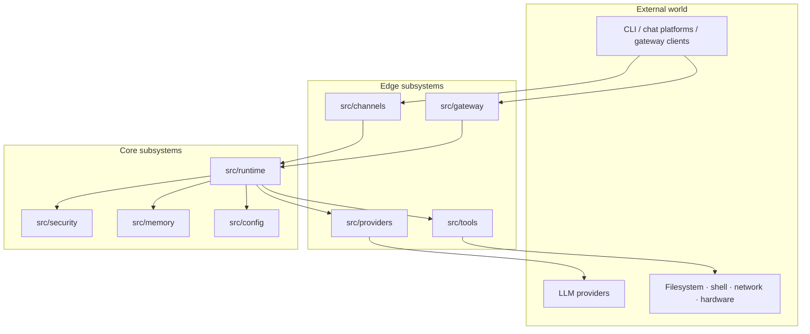
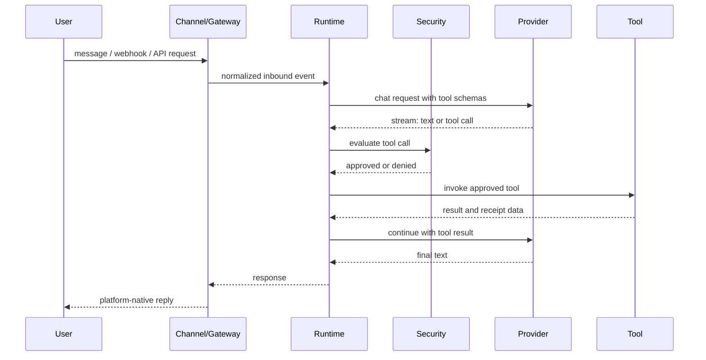

# Architecture Overview

SmolClaw is a modular C23 codebase. The public ABI lives in
`include/sc/`; concrete implementations live under
`src/<subsystem>/`.

## High-level Shape

## Modules In Scope

| Module | Role |
|---|---|
| `include/sc/` | Stable public headers, opaque handles, versioned vtables |
| `src/app/` | CLI, service integration, process lifecycle |
| `src/core/` | Allocators, strings, buffers, vectors, maps, errors |
| `src/runtime/` | Agent loop, prompt assembly, history, tool orchestration |
| `src/security/` | Policy checks, approvals, workspace boundaries, audit, receipts |
| `src/providers/` | Provider registry and built-in model providers |
| `src/tools/` | Tool registry and built-in tools |
| `src/channels/` | Channel registry and orchestration |
| `src/memory/` | Memory backends and retrieval |
| `src/gateway/` | HTTP, WebSocket, SSE, pairing, dashboard APIs |
| `src/hardware/` | USB, serial, GPIO, board support |
| `src/plugins/` | C ABI plugins and optional isolated plugin hosts |

## Request Lifecycle

Full detail: [Request lifecycle](./request-lifecycle.md).

## Extension Points

Providers, channels, tools, memory backends, observers, hardware adapters, and
plugins all use opaque handles plus `const` vtables. Registries own descriptor
metadata, and runtime code depends on registry contracts rather than concrete
implementations.

## Where To Read Next

- [Modular architecture map](./architecture-map.md)
- [Request lifecycle](./request-lifecycle.md)
- [Module map](./modules.md)
- [Dependency inventory](./dependency-inventory.md)
