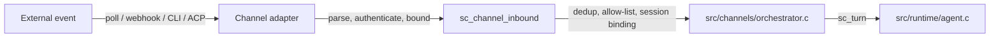
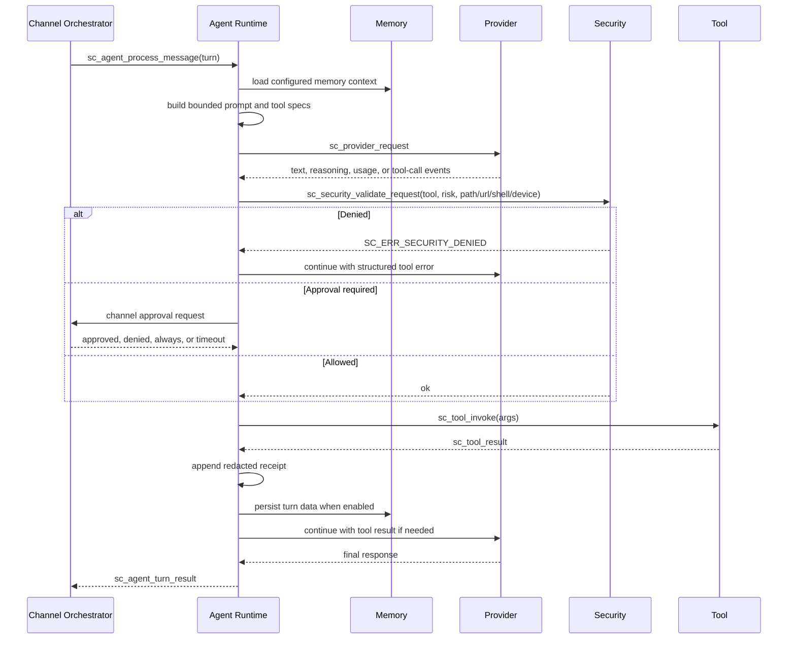

# Request Lifecycle

This page traces a user message through channels, the runtime, providers, tools,
security checks, receipts, and outbound delivery.

## Inbound

Adapters such as `src/channels/telegram.c`, `src/channels/webhooks.c`,
`src/channels/acp.c`, and the mail/RabbitMQ transport paths normalize
platform-native data into `sc_channel_inbound`. The adapter is responsible for
platform parsing, transport authentication where available, media screening,
size limits, and platform-specific reply context.

`src/channels/orchestrator.c` applies cross-channel behavior before the runtime
sees the event:

- Deduplicate recent platform message IDs.
- Apply configured sender and channel-specific tool allow/deny rules.
- Bind the event to a channel, sender, thread, and persisted session.
- Optionally mark the active turn for cancellation when `cancel_previous` or
  Telegram interruption is configured.
- Hand temporary attachment paths and media context to the runtime.

## Agent Loop

Key properties:

- Provider output is untrusted. Tool names, call IDs, and JSON arguments are
  validated against registered `sc_tool_spec` data before invocation.
- The runtime owns the provider/tool loop and enforces configured iteration,
  output, cost, timeout, and cancellation limits.
- Security validation happens before side effects. File, URL, shell, hardware,
  OTP, sandbox, and emergency-stop checks stay in `src/security/`.
- Tool results are bounded and summarized before they are inserted into model
  context or receipts.
- Receipts are hash-linked and HMAC-tokenized in memory; callers may persist
  them through the receipt store helpers.

## Streaming And Drafts

Providers can emit `sc_provider_stream_event` values for text deltas, reasoning
deltas, tool calls, final usage, errors, and done markers. When the configured
channel supports draft updates, the orchestrator can send interim text before
the final `sc_agent_turn_result`.

Telegram uses `stream_mode = "off"` by default. Draft-mode Telegram sends use
`sendMessageDraft` when available and fall back through the adapter behavior
tested in `tests/unit/test_channels.c`.

## Outbound

Outbound delivery goes through the same channel abstraction:

1. The runtime returns `sc_agent_turn_result`.
2. The orchestrator updates session history and persistence under
   `workspace/sessions/` when enabled.
3. The channel adapter formats the final text and any attachment for the
   platform.
4. Long replies are split or streamed according to adapter capabilities and
   platform limits.
5. User-visible errors are localized or summarized; internal error keys stay in
   logs, observer events, receipts, and tests.

## Where It Lives

| Flow | Primary files |
|---|---|
| Bootstrap and config wiring | `src/runtime/bootstrap.c`, `src/config/` |
| Agent loop | `src/runtime/agent.c` |
| Runtime scheduler | `src/runtime/loop.c`, `src/runtime/turn_queue.c` |
| Channel orchestration | `src/channels/orchestrator.c` |
| Telegram and webhooks | `src/channels/telegram.c`, `src/channels/webhooks.c` |
| Provider HTTP and parsing | `src/providers/http_providers.c`, `src/providers/compatible.c` |
| Tool invocation and wrappers | `src/tools/tool_common.c`, `src/tools/tool_wrappers.c`, `src/tools/*.c` |
| Security and receipts | `src/security/policy.c`, `src/security/receipts.c`, `src/security/store.c` |
